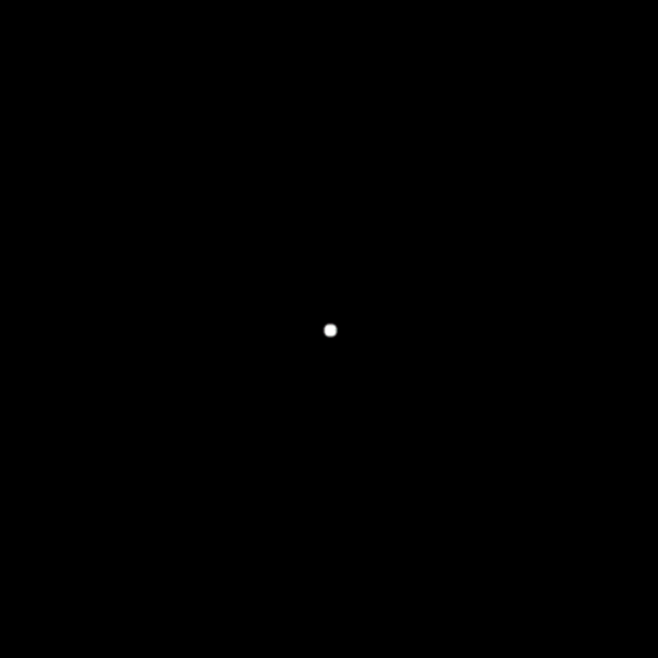
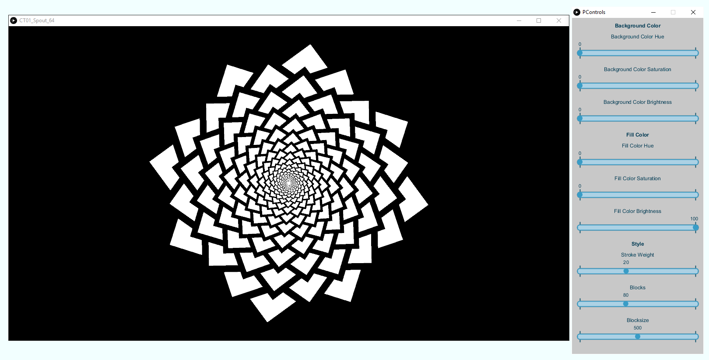

# Circle Theme

	

	

	

## The Package

The Circle Theme Package was developed by Mathias Markl and Marcell Bandi. All plugins can be used under the terms of the [GNU General Public License](http://www.gnu.org/licenses/gpl-3.0.de.html).

Find some great examples on our Facebook page - [Lucky Loop](https://www.facebook.com/luckyloop)

Some of the plugins are based or inspired by artists of [OpenProcessing](http://www.openprocessing.org/).

* [David Mrugala](http://www.openprocessing.org/user/37330/)
* [Jean-no](http://www.openprocessing.org/user/997/)
* [Michael Pinn](http://www.openprocessing.org/user/39442)
* [Jacob Joaquin](http://www.openprocessing.org/user/23998)
* [Jerome Herr](http://www.openprocessing.org/user/28663)

## Plugins

The plugins are Processing applications.

### Requirements

* ATI Radeon HD 5000 series or better (256MB of VRAM)
* NVIDIA GeForce 210 or better (256MB of VRAM)
* [Java JDK 8] (http://www.oracle.com/technetwork/java/javase/downloads/index.html) or later
* [Processing 3] (https://processing.org/) or later
* [Spout 2] (http://spout.zeal.co/) or [Syphon] (http://syphon.v002.info/)

### Spout

On Windows the applications can be used as a FreeFrame (FFGL) plugin.

	

### Syphon

On Mac the applications can be used as a Syphon server. More infos can be found on the [Syphon Homepage](http://syphon.v002.info/).

To control the sketch, you can open a control panel by pressing the 'c' key.

	

